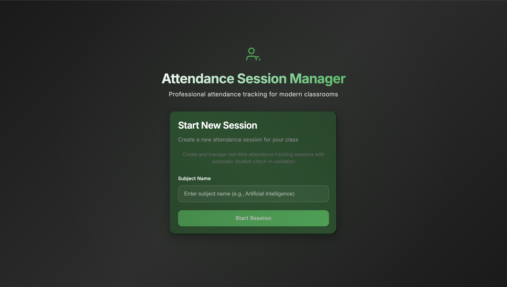

# Attendance Session Mock

A simple attendance tracking system built with FastAPI backend and React frontend. This is a mock implementation using in-memory storage only.

## Features

- **Multi-page Application**: Clean home page and dedicated session management page
- **Professional Navigation**: Sticky navbar with session status and attendee count
- **Modal Check-in**: Elegant popup for student registration
- **Real-time Updates**: Auto-refresh every 10 seconds
- **Comprehensive Error Handling**: Network errors, validation errors, and graceful degradation
- **Responsive Design**: Works perfectly on all device sizes
- **Dark Spotify Theme**: Modern, professional UI with smooth animations
- **Duplicate Prevention**: Case-insensitive roll number validation
- **Input Validation**: Character limits and format restrictions
- **No Database Required**: In-memory storage only

## Project Structure

```
attendance-mock/
├── backend/                    # FastAPI application
│   ├── main.py                # Main FastAPI server
│   └── requirements.txt       # Python dependencies
├── frontend/                  # React application
│   ├── src/
│   │   ├── components/        # React components
│   │   │   ├── HomePage.js    # Landing page
│   │   │   ├── SessionPage.js # Session management
│   │   │   ├── Navbar.js      # Navigation bar
│   │   │   └── CheckinModal.js # Student check-in modal
│   │   ├── App.js             # Main app with routing
│   │   └── index.css          # Styles
│   └── package.json           # Node.js dependencies
├── screenshots/               # Application screenshots
└── README.md                  # This file
```

## Backend Setup (FastAPI)

### Prerequisites
- Python 3.8+
- pip

### Installation & Running

1. Navigate to backend directory:
```bash
cd backend
```

2. Install dependencies:
```bash
pip install -r requirements.txt
```

3. Run the server:
```bash
uvicorn main:app --reload --host 0.0.0.0 --port 8000
```

The backend will be available at `http://localhost:8000`

## Frontend Setup (React)

### Prerequisites
- Node.js 16+
- npm

### Installation & Running

1. Navigate to frontend directory:
```bash
cd frontend
```

2. Install dependencies:
```bash
npm install
```

3. Start the development server:
```bash
npm start
```

The frontend will be available at `http://localhost:3000`

## API Endpoints

### Health Check
- **GET** `/health`
- Returns: `{"status": "UP"}`

### Session Management
- **POST** `/session/start`
  - Body: `{"subject": "string"}`
  - Returns: `{"session_id": "string", "subject": "string", "started_at": "datetime", "expires_at": "datetime"}`

- **GET** `/session/{id}`
  - Returns: `{"status": "active"|"ended", "subject": "string", "attendees_count": "number", "attendees": [{"roll_no": "string", "time": "datetime"}]}`

- **POST** `/session/{id}/checkin`
  - Body: `{"roll_no": "string"}`
  - Returns: `{"ok": true, "total": "number"}`

- **POST** `/session/{id}/end`
  - Returns: `{"ok": true}`

## Important Notes

- This is a **mock implementation** using in-memory storage only
- All data will be lost when the server restarts
- No database or persistent storage is used
- Designed for demonstration and testing purposes

## Deployment

Both backend and frontend are configured for easy deployment:

- **Backend**: Can be deployed to any Python hosting platform (Railway, Render, etc.)
- **Frontend**: Optimized for Netlify/Vercel deployment

## Screenshots

Here are some key screenshots showcasing the application's features:

### Home Page (Dark Theme)

*Professional landing page with dark Spotify theme, centered layout, and modern UI*

### Session Management

*Active session with real-time attendee tracking, management controls, and status indicators*

### Student Check-in Modal

*Elegant modal for student registration with validation and professional styling*

### Theme Switching

*Light theme demonstration showing the application's theme switching capability*

**View all screenshots in the [screenshots directory](screenshots/) for a complete overview of all features.**
