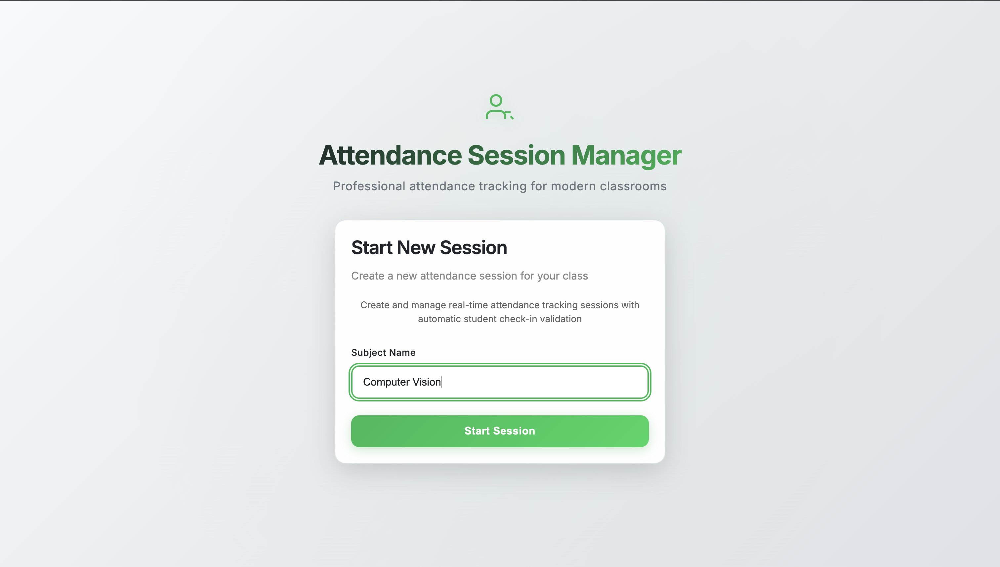
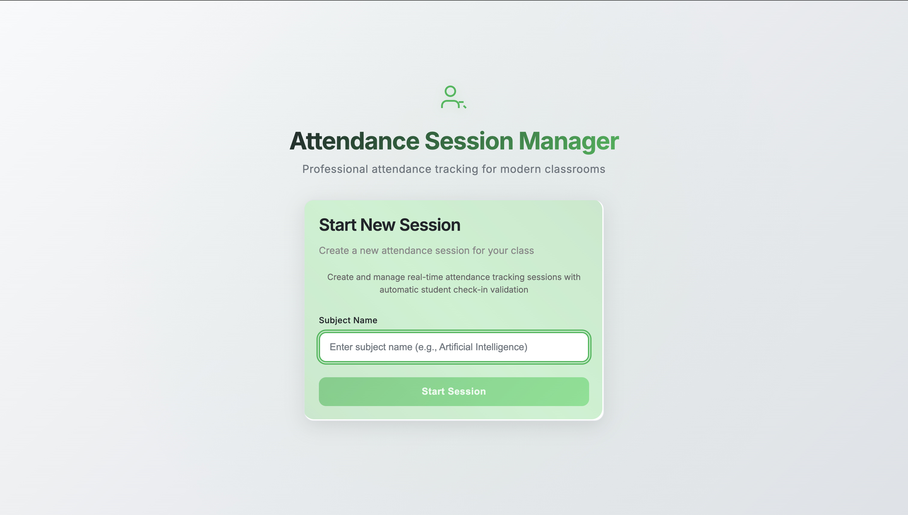
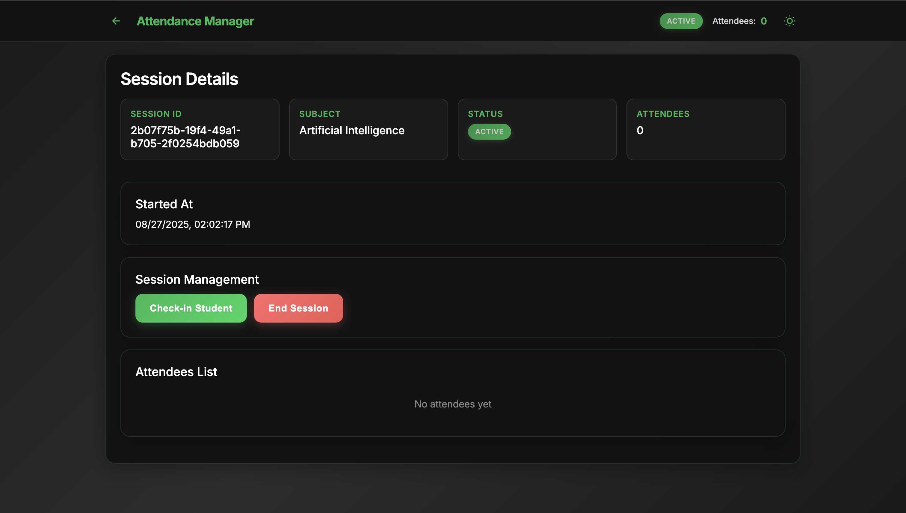
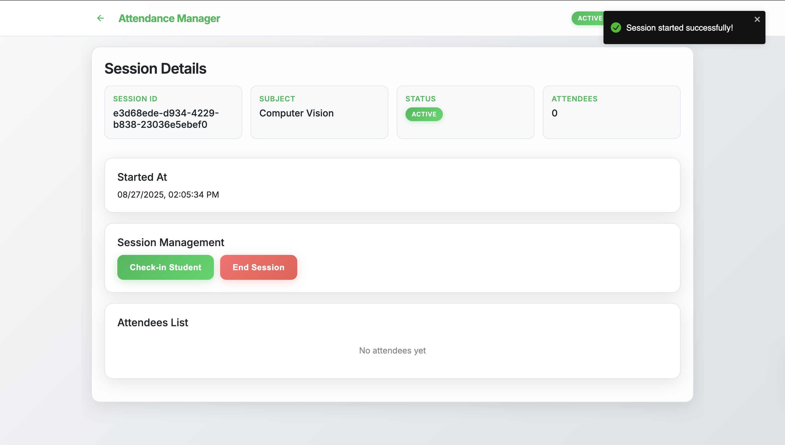
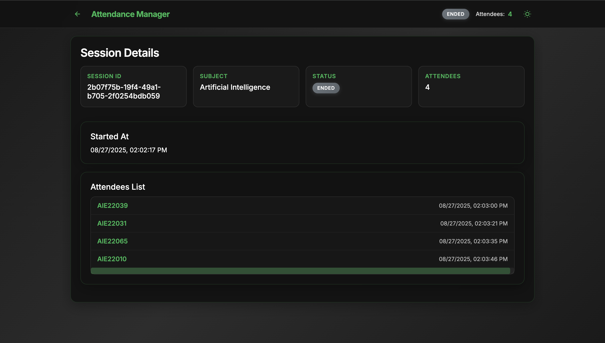
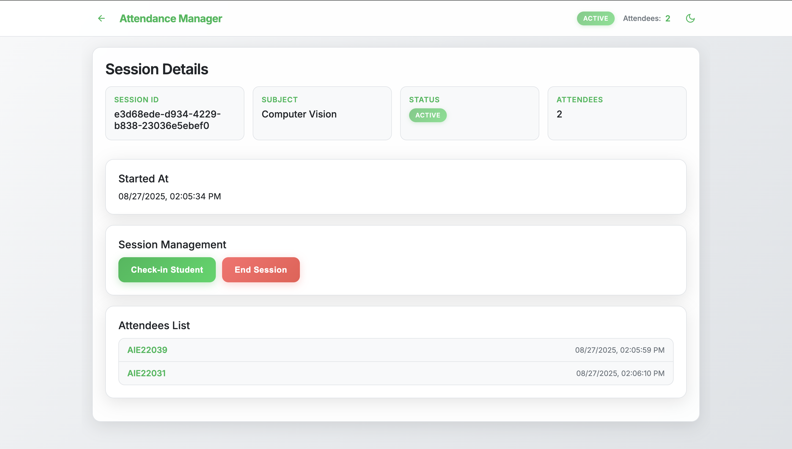
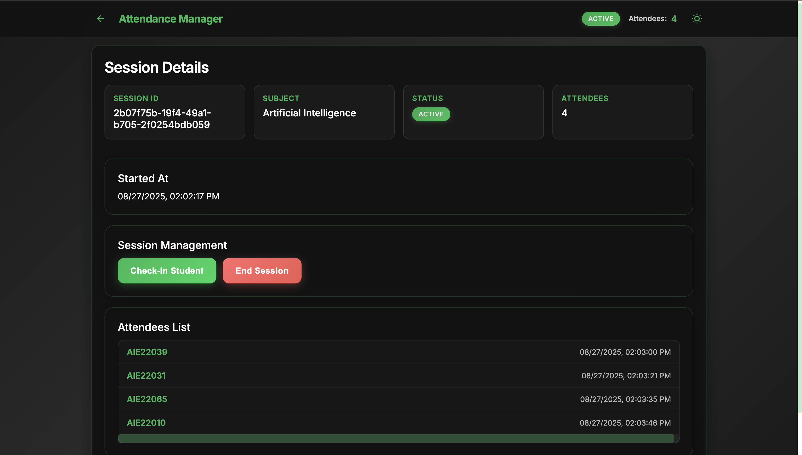
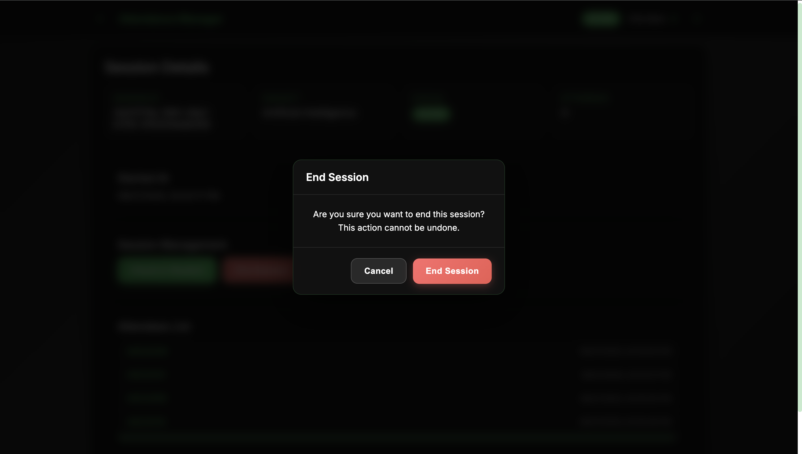
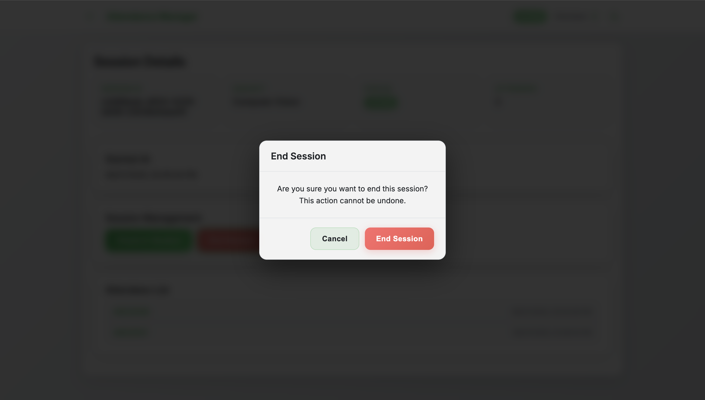
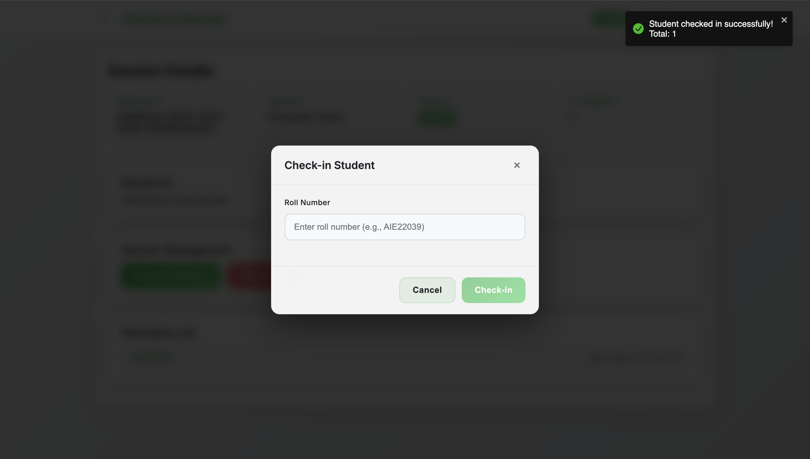

# Screenshots

This directory contains screenshots of the Attendance Session Mock application showcasing its features and functionality.

## Screenshot Gallery

### 1. Home Page (Dark Theme)

- **Description**: Professional landing page with dark Spotify theme
- **Features**: 
  - Centered layout with professional header
  - Gradient title "Attendance Session Manager"
  - Icon with people management symbolism
  - Subject input field with placeholder
  - Green "Start Session" button
  - Smooth animations and modern UI

### 2. Home Page (Light Theme)

- **Description**: Clean light theme version of the home page
- **Features**:
  - White background with dark text
  - Same professional layout
  - "Computer Vision" entered in subject field
  - Consistent spacing and typography
  - Theme toggle functionality demonstrated

### 3. Home Page (Light Theme - Alternative)

- **Description**: Alternative view of light theme home page
- **Features**:
  - Different angle or state of light theme
  - Consistent design and functionality
  - Professional appearance maintained

### 4. Session Details (Active - Dark Theme)

- **Description**: Active session management page in dark theme
- **Features**:
  - Navigation bar with back button and theme toggle
  - Session ID, Subject, Status, and Attendee count
  - "ACTIVE" status badge in green
  - Session management buttons (Check-in, End Session)
  - Attendees list with timestamps
  - Auto-refresh functionality

### 5. Session Details (Active - Light Theme)

- **Description**: Active session management page in light theme
- **Features**:
  - Same functionality as dark theme
  - Light background with dark text
  - Consistent button styling and layout
  - Theme switching capability demonstrated

### 6. Session Details (Ended - Dark Theme)

- **Description**: Session after being ended in dark theme
- **Features**:
  - "ENDED" status badge in grey
  - Same layout but with ended state
  - Session management buttons hidden
  - Attendees list preserved
  - Historical data display

### 7. Attendees List (Light Theme)

- **Description**: Detailed view of attendees list in light theme
- **Features**:
  - Clear list of checked-in students
  - Roll numbers and timestamps
  - Light theme styling
  - Scrollable list interface

### 8. Session Student List

- **Description**: General view of student attendance list
- **Features**:
  - Multiple students checked in
  - Timestamp information
  - Clean list formatting
  - Professional data presentation

### 9. Check-in Modal (Dark Theme)

- **Description**: Student check-in popup in dark theme
- **Features**:
  - Modal overlay with blurred background
  - Roll number input field with placeholder
  - Cancel and Check-in buttons
  - Proper spacing between elements
  - Focus states and validation

### 10. Check-in Modal (Light Theme)

- **Description**: Student check-in popup in light theme
- **Features**:
  - White modal on light background
  - Same functionality as dark theme
  - Consistent button styling
  - Theme switching capability
  - Accessibility maintained

### 11. End Session Modal (Dark Theme)

- **Description**: Custom confirmation dialog for ending sessions in dark theme
- **Features**:
  - Replaces browser's default confirm
  - Clear warning message
  - Cancel and End Session buttons
  - Destructive action styling (red button)
  - User-friendly confirmation flow

### 12. End Session Modal (Light Theme)

- **Description**: Custom confirmation dialog for ending sessions in light theme
- **Features**:
  - Same functionality as dark theme
  - Light background styling
  - Consistent button design
  - Theme switching demonstrated

### 13. Success Toast Notification

- **Description**: Toast notification for successful actions
- **Features**:
  - Top-right positioned notification
  - Green checkmark icon
  - "Student checked in successfully!" message
  - Total attendee count display
  - Auto-dismiss functionality
  - Professional notification design

## Technical Features Demonstrated

- **Responsive Design**: Works on all screen sizes
- **Theme Switching**: Dark and light theme support across all components
- **Real-time Updates**: Auto-refresh every 10 seconds
- **Modal Interactions**: Professional popup dialogs for both themes
- **Toast Notifications**: User feedback system
- **Form Validation**: Input validation and error handling
- **Navigation**: Multi-page structure with routing
- **Professional UI**: Modern, clean design with animations
- **Accessibility**: Proper contrast and readability in both themes

## Usage Instructions

1. **Start Session**: Enter subject name and click "Start Session"
2. **Check-in Students**: Click "Check-in Student" button and enter roll number
3. **End Session**: Click "End Session" and confirm in modal
4. **Switch Themes**: Use the theme toggle in the navigation bar
5. **Navigate**: Use back button to return to home page

## Theme Comparison

The screenshots demonstrate the application's ability to switch seamlessly between:
- **Dark Theme**: Professional, modern appearance with green accents
- **Light Theme**: Clean, accessible design with proper contrast

All screenshots showcase the "top-notch" UI design with smooth animations, proper spacing, and professional appearance as requested in the project requirements.
